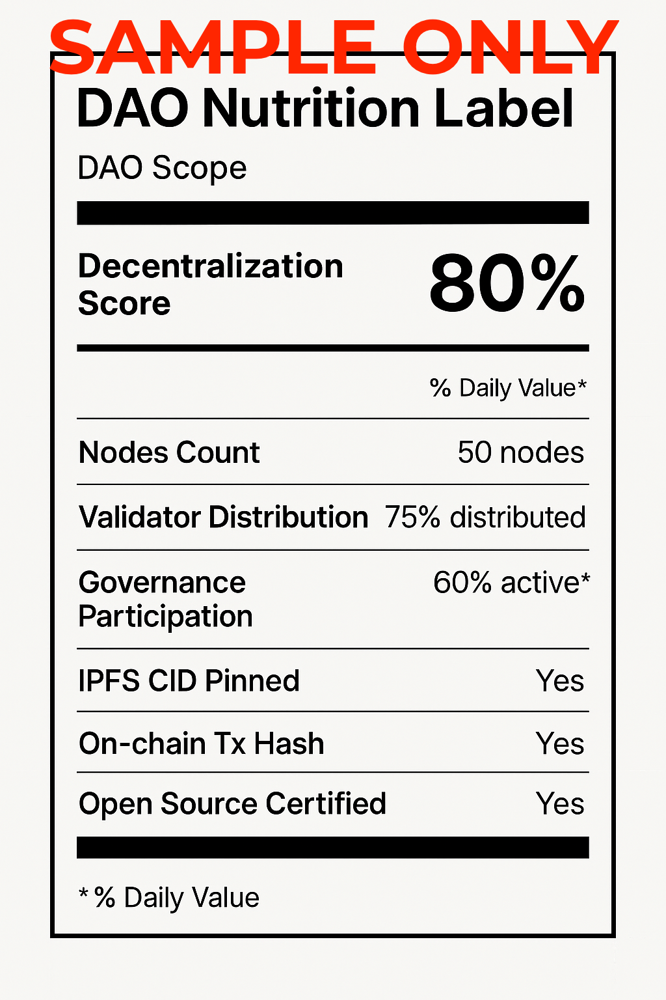
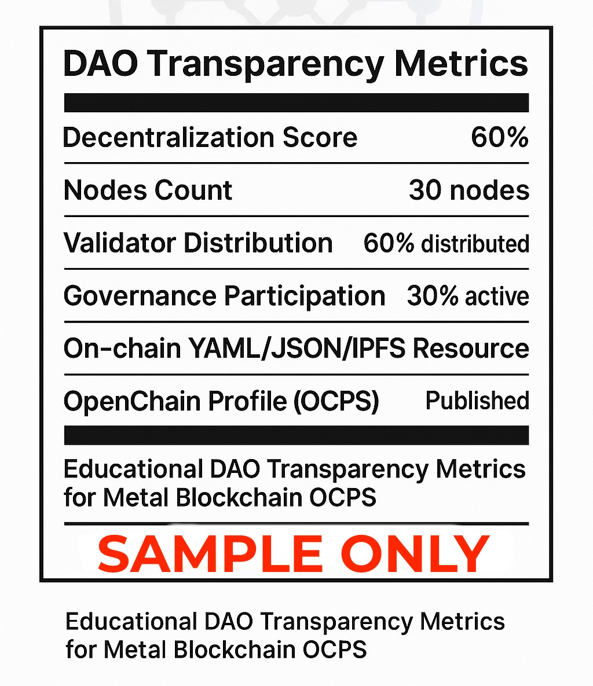
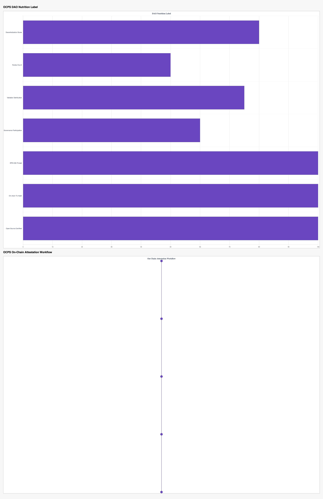

<p align="center">
  
  
  
  
  
</p>
<p align="center">
  <a href="CONTRIBUTING.md">
    
  </a>
</p>

# An open-source, community-driven transparency profile standard for measuring decentralization for DAOs and Metal Blockchain ecosystem projects.

---

# 🚀 START CONTRIBUTING YOUR DAO PROFILE! 🚀

💡 **All DAO profiles live here:** [`profiles/`](./profiles/)  
📄 **Copy the sample file, fill in your details, and submit your contribution.**  
🙏 Every profile helps build transparency for the Metal Blockchain community!

---

## Table of Contents

- [Features](#features)
- [Standards Alignment](#standards-alignment)
- [Contributing](#contributing)
- [DAO Profile Template](#dao-profile-template)
- [License](#license)
- [Docs](#docs)
- [IPFS Transparency](#ipfs-transparency)
- [On-Chain Attestation](#on-chain-attestation)
- [Visuals](#visuals)
  - [DAO Nutrition Label](#dao-nutrition-label)
- [Next Milestone](#next-milestone)

---

## Features
- ✅ YAML, JSON, PDF profile structures  
- ✅ IPFS pinned transparency certificates  
- ✅ On-chain attestation foundation  
- ✅ Supports upcoming regulatory clarity

---

## Standards Alignment
OCPS aligns with broader DAO transparency initiatives like [EIP-4824](https://eips.ethereum.org/EIPS/eip-4824), which defines a `dao://` URI scheme for discovering DAO metadata. While EIP-4824 focuses on *where* DAO metadata lives, OCPS focuses on *what* decentralization metrics are transparently measured and certified for DAOs.

Future versions of OCPS will explore JSON-LD export for cross-chain `dao://` discoverability, enabling aligned, chain-agnostic DAO transparency while building community-driven certification tooling in the Metal Blockchain ecosystem.

---

## Contributing
Pull requests and issues are welcome to improve metrics and tooling.

---

## DAO Profile Template

All contributed DAO profiles live in the [`profiles/`](./profiles/) folder. To contribute:

1. Copy the [`sample_dao.yaml`](./profiles/sample_dao.yaml) file  
2. Rename it to your DAO’s name (e.g., `mydao.yaml`)  
3. Fill in your DAO’s details, governance model, and transparency info  
4. Commit your file via pull request

**Sample DAO profile content:**

```yaml
dao_name: ExampleDAO
chain: Metal Blockchain (XPR Network)
version: v0.1.2
created: 2025-09-08
contributors:
  - name: Austin Auger
    role: Maintainer
governance:
  model: Token-weighted voting
  token: EXM
  supply: 1,000,000
  quorum: 15%
  voting_period: 7 days
transparency:
  ipfs_cid: bafkreicsmi3psin7klvrsarl36b3zoxlv2722ru3yhqzne2tmhc6fqss3u
  attestation_tx: 2d6b62ded2f59965a2ad911972291f60e453275dcab58c954f1f657ed1fda349
  attestor: austinauger
notes: >
  This is a sample DAO profile submission for contributors to copy and adapt.
```

---

## License
**CC-BY 4.0** – reuse with attribution.

---

## 📚 Docs  
- [Vision](docs/vision_doc.md)  
- [Public Explainer](docs/public_explainer.md)  
- [Roadmap](docs/v0.2_roadmap.md)  

💡 **All DAO profiles live here:** [profiles/](./profiles/)  
---

[## IPFS Transparency
We pin OCPS profiles to IPFS for verifiable decentralization snapshots:  
- **Current CID:** `bafkreicsmi3psin7klvrsarl36b3zoxlv2722ru3yhqzne2tmhc6fqss3u`  
- **View on IPFS Gateway:**  
  - [dweb.link](https://dweb.link/ipfs/bafybeifjpj2lqibtgmwv7u7e5lonzbriz2zq4wiyuyp267lelnbzohpvwm)  
  - [ipfs.io](https://ipfs.io/ipfs/bafybeifjpj2lqibtgmwv7u7e5lonzbriz2zq4wiyuyp267lelnbzohpvwm)](https://bafybeifjpj2lqibtgmwv7u7e5lonzbriz2zq4wiyuyp267lelnbzohpvwm.ipfs.dweb.link/)

---

## On-Chain Attestation
To verify the timestamped, on-chain attestation of this OCPS version on The XPRNetwork Blockchain:  
- **Attestation made by:** austinauger  
- **On-chain memo:** `OCPS v0.1.2 CID: bafkreicsmi3psin7klvrsarl36b3zoxlv2722ru3yhqzne2tmhc6fqss3u`  
- ✅ **View On-Chain Attestation on XPRNetwork Explorer**

---

## Visuals

### DAO Nutrition Label
<p align="center">
  
  
  
</p>

---

## Next Milestone
We are preparing for **OCPS v0.2** to include:  
- DAO Nutrition Label standardization  
- GitHub Actions for automated IPFS pinning and attestation log updates  
- Contributor workflow for submitting DAO transparency profiles  
- Expanded documentation for on-chain attestation tutorials  
- Community education assets for X, GitHub, and DAO forums  

Ready to certify transparency together!

