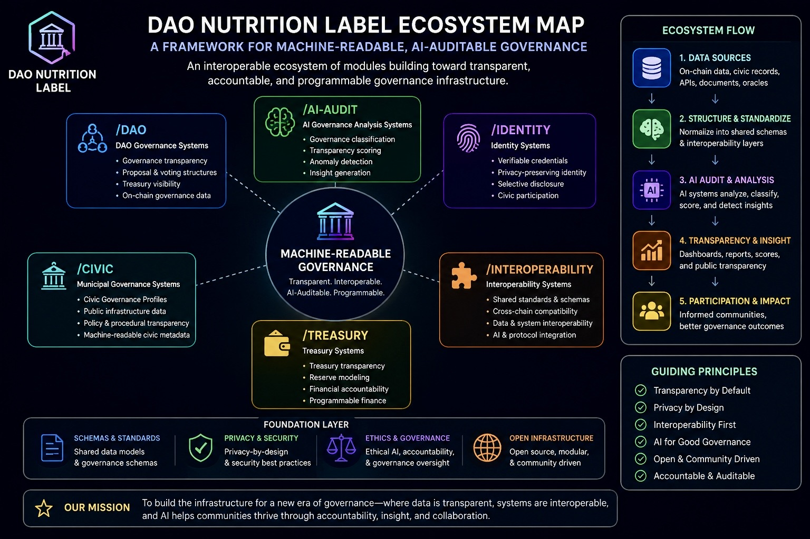

<!-- START doctoc generated TOC please keep comment here to allow auto update -->
<!-- DON'T EDIT THIS SECTION, INSTEAD RE-RUN doctoc TO UPDATE -->
**Table of Contents**

- [Ecosystem Architecture](#ecosystem-architecture)
- [DAO Nutrition Label](#dao-nutrition-label)
  - [Features](#features)
  - [OGIS — Integrity & Data Layer](#ogis--integrity--data-layer)
  - [Standards Alignment](#standards-alignment)
  - [How It Works (10-minute contribution)](#how-it-works-10-minute-contribution)
  - [DAO Profile Template](#dao-profile-template)
  - [Examples](#examples)
  - [IPFS & On-Chain Transparency](#ipfs--on-chain-transparency)
  - [Visuals](#visuals)
  - [Docs](#docs)
  - [Next Milestone – v0.2](#next-milestone--v02)
  - [Contributing](#contributing)
  - [License](#license)
- [Ecosystem Modules](#ecosystem-modules)
  - [🧪 First MiCA Implementation Example](#-first-mica-implementation-example)

<!-- END doctoc generated TOC please keep comment here to allow auto update -->

# Ecosystem Architecture



# DAO Nutrition Label


**The food nutrition label for DAOs — transparency in 30 seconds.**


[](https://creativecommons.org/licenses/by/4.0/)


**See a real label here → [Live IPFS Example](https://dweb.link/ipfs/bafybeifjpj2lqibtgmwv7u7e5lonzbriz2zq4wiyuyp267lelnbzohpvwm)**

---

An open-source, community-driven transparency profile standard for measuring decentralization for DAOs and Metal Blockchain ecosystem projects.

Built on the **OpenChain Profile Standard (OCPS v0.1.2)** with visual “nutrition label” summaries, IPFS pinning, and on-chain attestations.

---

## Features
- ✅ YAML + JSON + PDF profile formats  
- ✅ IPFS pinned transparency certificates  
- ✅ On-chain attestation on XPR Network  
- ✅ zk-DID extension for privacy-preserving compliance  
- ✅ Aligned with EIP-4824 for cross-chain discoverability

---

## OGIS — Integrity & Data Layer

The DAO Nutrition Label is supported by the **Open Governance Integrity Standard (OGIS)**, a structured framework for reporting governance transparency and integrity metrics.

OGIS provides the underlying data model and reporting schema that powers the DAO Nutrition Label, including:

- Capital concentration metrics  
- Participation data  
- Identity distribution (optional)  
- Sentiment integrity indicators (optional)  
- Governance risk exposure  

View the full standard here:  
👉 [Open Governance Integrity Standard (OGIS)](./ogis/README.md)

---

## Standards Alignment
The DAO Nutrition Label focuses on **what** decentralization metrics matter.  
It builds on [EIP-4824](https://eips.ethereum.org/EIPS/eip-4824) (`dao://` URI scheme) and adds the missing visual + certification layer.

---

### Optional Dynamic / Oracle Metrics Extension (v0.1)

Starting with schema version v0.1.3, the DAO Nutrition Label supports an **optional** `dynamic_metrics` section. This allows profiles to include live, oracle-powered data (for example via API3 dAPIs on Metal L2) alongside the traditional static governance fields.

- Static fields remain the core of the Nutrition Label and continue to be attested as before.
- Dynamic fields are clearly marked, optional, and can pull live values such as circulating supply, holder concentration, market data, or composite decentralization scores.
- A matching JSON Schema is available at [`schemas/dynamic-oracle-v0.1.schema.json`](./schemas/dynamic-oracle-v0.1.schema.json).
- See the example profile: [`profiles/sample_dao_with_dynamic.yaml`](./profiles/sample_dao_with_dynamic.yaml).

This extension is fully backward-compatible. Profiles without the `dynamic_metrics` section remain valid.

---

## How It Works (10-minute contribution)
1. Copy [`profiles/sample_dao.yaml`](./profiles/sample_dao.yaml)  
2. Rename it to your DAO name (e.g. `my-dao.yaml`)  
3. Fill in your details  
4. Open a Pull Request to the [`profiles/`](./profiles/) folder  

Every profile helps the entire Metal Blockchain community!

---

## DAO Profile Template

```yaml
dao_name: ExampleDAO
chain: Metal Blockchain (XPR Network)
version: v0.1.2
created: 2025-09-08
contributors:
  - name: Austin Auger
    role: Maintainer
governance:
  model: Token-weighted voting
  token: EXM
  supply: 1,000,000
  quorum: 15%
  voting_period: 7 days
transparency:
  ipfs_cid: bafkreicsmi3psin7klvrsarl36b3zoxlv2722ru3yhqzne2tmhc6fqss3u
  attestation_tx: 2d6b62ded2f59965a2ad911972291f60e453275dcab58c954f1f657ed1fda349
  attestor: austinauger
notes: >
  This is a sample DAO profile submission for contributors to copy and adapt.
Extensions
dao-nutrition-label-zkdid-extension (v0.1)
Zero-knowledge DID verification for age/sanctions compliance while staying privacy-first.
→ extensions/dao-nutrition-label-zkdid-extension-v0.1.yaml
```
## Examples
**DAO with zk-DID access control**  
→ [`examples/dao-with-zkdid.yaml`](./examples/dao-with-zkdid.yaml)

---

## IPFS & On-Chain Transparency
- Sample Profile IPFS CID: `bafkreicsmi3psin7klvrsarl36b3zoxlv2722ru3yhqzne2tmhc6fqss3u`  
- Live Visual Label: [View on IPFS](https://dweb.link/ipfs/bafybeifjpj2lqibtgmwv7u7e5lonzbriz2zq4wiyuyp267lelnbzohpvwm)  
- On-chain Attestation (XPR Network): [Explorer Link](https://explorer.xprnetwork.org/transaction/2d6b62ded2f59965a2ad911972291f60e453275dcab58c954f1f657ed1fda349)  
  Attestor: austinauger

---

## Visuals
  
[📁 Open visuals folder](./visuals/)

---

## Docs
- [Vision](docs/vision_doc.md)  
- [Public Explainer](docs/public_explainer.md)  
- [v0.2 Roadmap](docs/v0.2_roadmap.md)

---

## Next Milestone – v0.2
- Automated GitHub Actions for IPFS pinning & attestation  
- Expanded contributor tooling  
- Community education assets  
- Full standardization of the visual label

---

## Contributing
Pull requests and issues are welcome!  
**Best way to start:** Submit your DAO profile using the 10-minute guide above.  

See [`CONTRIBUTING.md`](./CONTRIBUTING.md) for details.

---

## License
This project is licensed under [Creative Commons Attribution 4.0 International](./LICENSE).

---

**🚀 Ready to make your DAO transparent?**  
**Submit your DAO profile in 10 minutes →** [`profiles/`](./profiles/)

Every profile counts. Let’s build trust together on Metal Blockchain& Beyond!🤘

---

# Ecosystem Modules

- [`/dao`](./dao) → DAO governance transparency
- [`/civic`](./civic) → municipal governance transparency
- [`/ai-audit`](./ai-audit) → AI governance analysis systems
- [`/identity`](./identity) → privacy-preserving governance identity systems
- [`/treasury`](./treasury) → treasury transparency infrastructure
- [`/interoperability`](./interoperability) → governance interoperability systems

See [`/docs/ecosystem-map.md`](./docs/ecosystem-map.md) for architecture overview.

---

## 🧪 First MiCA Implementation Example

The first real-world application of the DAO Nutrition Label MiCA module is now live:

👉 Metal Blockchain MiCA Nutrition Label

- [Machine-readable profile](./profiles/metal-blockchain-mica-profile.yaml)
- [Human-readable label](./visuals/metal-blockchain-mica-label.md)

This serves as a reference implementation for how blockchain ecosystems can be evaluated under MiCA-aligned transparency standards.

Future expansions will include:
- Multi-chain comparisons
- DAO-submitted profiles
- Automated scoring calculations
- On-chain attestations
